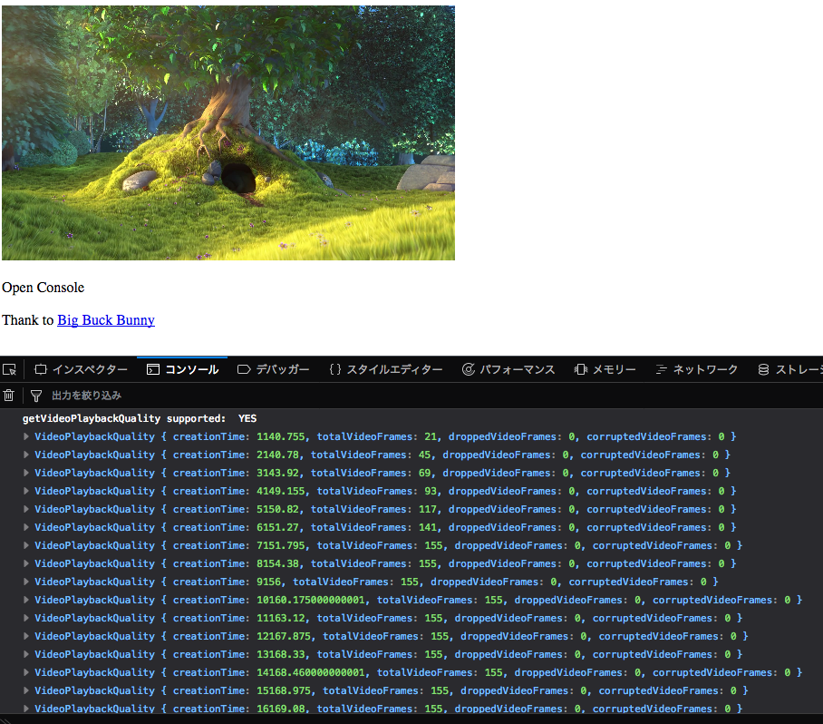

# VideoPlaybackQuality-polyfill

A polyfill/ponyfill for [`HTMLVideoElement.prototype.getVideoPlaybackQuality()`](https://developer.mozilla.org/ja/docs/Web/API/HTMLVideoElement/getVideoPlaybackQuality "HTMLVideoElement.getVideoPlaybackQuality()").

[`HTMLVideoElement.prototype.getVideoPlaybackQuality()`](https://developer.mozilla.org/ja/docs/Web/API/HTMLVideoElement/getVideoPlaybackQuality "HTMLVideoElement.getVideoPlaybackQuality()") return a [VideoPlaybackQuality](https://developer.mozilla.org/en-US/docs/Web/API/VideoPlaybackQuality "VideoPlaybackQuality - Web APIs | MDN") object.


For more details, see [Media Playback Quality](https://wicg.github.io/media-playback-quality/#videoplaybackquality-interface "Media Playback Quality")

[](./example/)

## Install

Install with [npm](https://www.npmjs.com/):

    npm install videoplaybackquality

## Usage

### Polyfill

```js
require("videoplaybackquality/polyfill");
// usage
var video = document.getElementById("js-video");
console.log(video.getVideoPlaybackQuality());
```

### Use as a module(Ponyfill)

```js
const getVideoPlaybackQuality = require("videoplaybackquality").getVideoPlaybackQuality;
// usage
var video = document.getElementById("js-video");
getVideoPlaybackQuality(video);
/*
{
        'droppedVideoFrames': 0,
        'totalVideoFrames': 0,
        'corruptedVideoFrames': 0,
        'creationTime': 0,
        'totalFrameDelay': 0
}
*
```

### Example

See [example/](example)

### Limitation

WebKit can not get complete [VideoPlaybackQuality](https://developer.mozilla.org/en-US/docs/Web/API/VideoPlaybackQuality "VideoPlaybackQuality - Web APIs | MDN").

This polyfill return following data:

```js
{
        'droppedVideoFrames': webKitVideo.webkitDroppedFrameCount,
        'totalVideoFrames': webKitVideo.webkitDecodedFrameCount,
        // Not provided by this polyfill:
        'corruptedVideoFrames': 0,
        'creationTime': NaN,
        'totalFrameDelay': 0
}
```

## Changelog

See [Releases page](https://github.com/azu/VideoPlaybackQuality-polyfill/releases).

## Running tests

Install devDependencies and Run `npm test`:

    npm i -d && npm test

## Contributing

Pull requests and stars are always welcome.

For bugs and feature requests, [please create an issue](https://github.com/azu/VideoPlaybackQuality-polyfill/issues).

1. Fork it!
2. Create your feature branch: `git checkout -b my-new-feature`
3. Commit your changes: `git commit -am 'Add some feature'`
4. Push to the branch: `git push origin my-new-feature`
5. Submit a pull request :D

## Author

- [github/azu](https://github.com/azu)
- [twitter/azu_re](https://twitter.com/azu_re)

## License

MIT © azu
